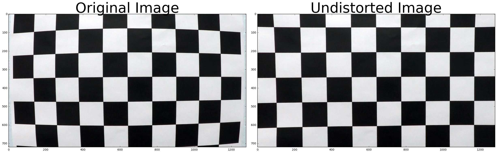
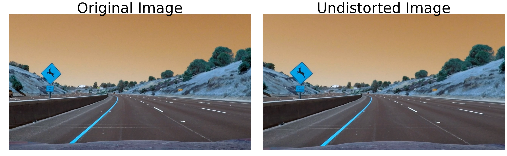
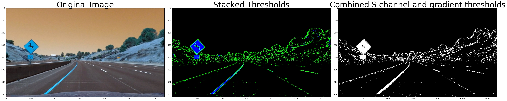
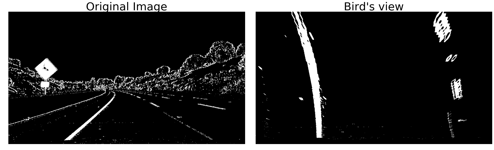
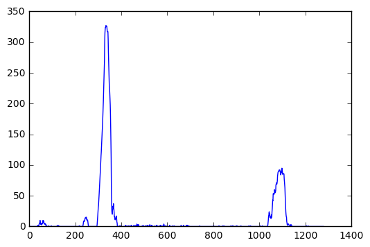
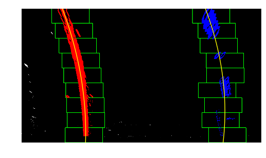
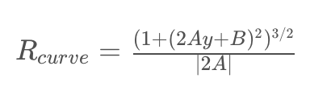
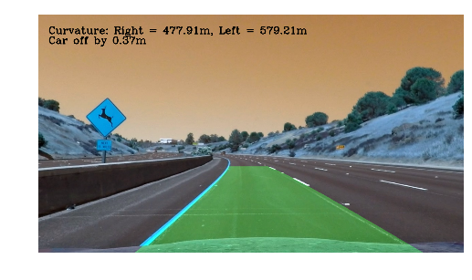

# Project 4: Advanced Lane Finding Project
---

## Introduction

The goals / steps of this project are the following:

* Compute the camera calibration matrix and distortion coefficients given a set of chessboard images.
* Apply a distortion correction to raw images.
* Use color transforms, gradients, etc., to create a thresholded binary image.
* Apply a perspective transform to rectify binary image ("birds-eye view").
* Detect lane pixels and fit to find the lane boundary.
* Determine the curvature of the lane and vehicle position with respect to center.
* Warp the detected lane boundaries back onto the original image.
* Output visual display of the lane boundaries and numerical estimation of lane curvature and vehicle position.

## Files

* Visualization.ipynb: A jupyter notebook showing each step of line detection for a single image
* project_video_output.mp4: The output video of the line detection pipeline
* README.md: a report writeup file

### Camera Calibration

When a camera looks at 3D objects in the real world and transforms them into a 2D image, image distortion occurs, because this transformation isn’t perfect. Distortion changes what the shape and size of these 3D objects appear to be. So before running the line detection pipeline I calibrated the camera, otherwise the lines would appear distorted.

To calibrate the camera, the idea is to map the coordinates of the distorted 2D image (image points) to the 3D coordinates of the real image undistorted points (object points). The transformation from image points to object points, is a matrix that can be used to undistort all images taken by that camera.

The object points are always the same. They are the known coordinates of the corners of a 9x6 chessboard (x, y, z) coordinates from top left corner. For the image points I found the corners of the chessboard on the distorted image using the OpenCV `findChessboardCorners` function. I run the function on multiple images of a chessboard taken at different angles and distances and once collected all image points, I computed the camera matrix and distortion coefficients with the OpenCV function `calibrateCamera`.

I applied this distortion correction to the test image using the `cv2.undistort()` function and obtained this result:



The code for the camera calibration is in section 1 and 2 of Visualization.ipynb.

### Pipeline (single images)

#### 1. Apply distortion correction

Having calibrated the camera using the chessboard images, I used the camera matrix and distortion coefficients to undistort the images that will go through the pipeline for lane detection.



#### 2. Color and gradient thresholding

Once the image has been undistorted I apply color and gradient thresholding to find pixels that are potentially part of a line in the image.

I experimented with RGB and HLS color spaces and tried to find channels that can pick up lines well. I found out that the S channel is cleaner than the H channel result and a bit better in some cases than the R channel

The final image color_binary is a combination of binary thresholding the S channel (HLS) and binary thresholding the result of applying the Sobel operator in the x direction on the L channel.



The code for the thresholded binary image is in section 3 of Visualization.ipynb.

#### 3. Perspective transform

Having created a color and gradient threshold binary image, I transformed the image perspective to bird's view. This transform allows to map the points of the masked image to image points with a new perspective that let’s us view a lane from above; this is useful for calculating the lane curvature.

To apply the perspective transform I first chose some pixels in the initial image and then I defined to which pixels in the new image they should correspond to.

| Source        | Destination   |
|:-------------:|:-------------:|
| 270,675       | 270,675       |
| 580,460       | 270,0         |
| 700,460       | 1035,0        |
| 1035,675      | 1035,675      |

The perspective transform matrix is calculated with `cv2.getPerspectiveTransform(src, dst)` and is used as input to the function `cv2.warpPerspective` to give the result



In the warped image the lines appear parallel, as expected so the transform is verified to be working. The code for the my perspective transform is in section 4 of Visualization.ipynb.

#### 4. Lane line location and polynomial fitting

After applying calibration, thresholding, and a perspective transform to a road image the result is a binary image where the lane lines stand out clearly. In order to decide explicitly which pixels are part of the lines and which belong to the left line and which belong to the right line, I first take a histogram along all the columns in the lower half of the image.



With this histogram I am adding up the pixel values along each column in the image. In my thresholded binary image, pixels are either 0 or 1, so the two most prominent peaks in this histogram will be good indicators of the x-position of the base of the lane lines. I can use that as a starting point for where to search for the lines. From that point, I can use a sliding window, placed around the line centers, to find and follow the lines up to the top of the frame.



By knowing where the lines are, in the next frame of video I don't need to do a blind search again, but instead you I just search in a margin around the previous line position.

For some frames the detection of the lanes can have significant deviation, so I found it useful to use the information from the 10 most recent frames every time to smooth the result (methods `smoothing` and `detect_lane_use_prev` of LineDetector). In case of wrong results (lines not being parallel anymore) I start from scratch with the histogram calculation again.

```bash
# Do lane line detection from scratch if std of r-l line distance is high
line_std = np.std(self.right_line.allx - self.left_line.allx)

if (line_std > 80):
    self.left_line.detected = False
    self.right_line.detected = False

```

All code for the finding the histogram, calculating the polynomial fitting, using the polynomial of the previous frame and drawing the result is in section 5 of Visualization.ipynb.

#### 5. Lane curvature and car position

For the radius of the lines I use the formula:



A and B are the coefficients of the derivative of the second order polynomials I calculated in the previous step. The radius of curvature is measured at the point closest to the vehicle, which is at the bottom of the image (max value of y).

To fit the calculation from pixel space to real world I used the following conversions:

```bash
# Define conversions in x and y from pixels space to meters
ym_per_pix = 30/720 # meters per pixel in y dimension
xm_per_pix = 3.7/700 # meters per pixel in x dimension
```
The car position is estimated as the difference between the center of the image and the middle point between the right and the left lane.

The code is for radius calculation in section 6 and for car position in section 8 of Visualization.ipynb.

#### 6. Final result

The result from steps 3, 4 and 5 is warped back to the initial perspective and is plotted with the information for the lane curvature and the off center car position.



The corresponding code is in section 8 of Visualization.ipynb.


### Pipeline (video)

Each of the previous steps is implemented as a method of the LineDetector class and can be applied on an image by calling `LineDetector.pipeline()`. This method is used to find right and left lanes in the project video.
My video result can be found [here](https://www.youtube.com/watch?v=h80N4dAPAnk)

---

### Discussion

**Steps I used to coming up with the final pipeline**

- Initially I applied the steps described in the course lectures and calculated the histogram of the binary image on each frame.
- The results improved by using information of previous frame, however the detector was still not performing well in two parts of the video, with shadow on the road.
- Finally I used average value of last 10 frames to smooth the results. In case of wrong results (lines not being parallel anymore) I start from scratch with the histogram calculation again.

**Issues faced**

The pipeline didn't work well on some parts of the challenge video. The detector was confused by lines of different color or when they were covered by shadows and had issues with cracks and dark trails near the lane lines.

**How to improve**

One idea would be to use region proposal networks for detecting lanes on the masked image. Alternatively I was thinking of experimenting on the images were my pipeline doesn't work well, try different color channels and gradient thresholds and try to find a combination that removes shadows and cracks and keeps only lanes by using a weighted average for the final threshold.
